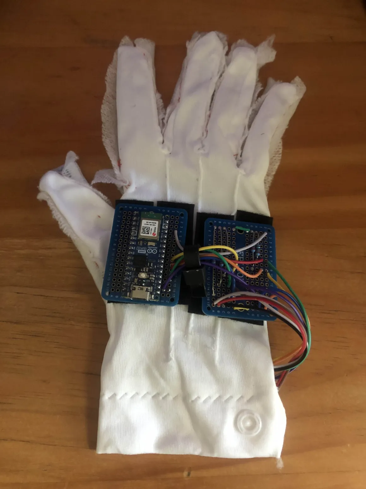
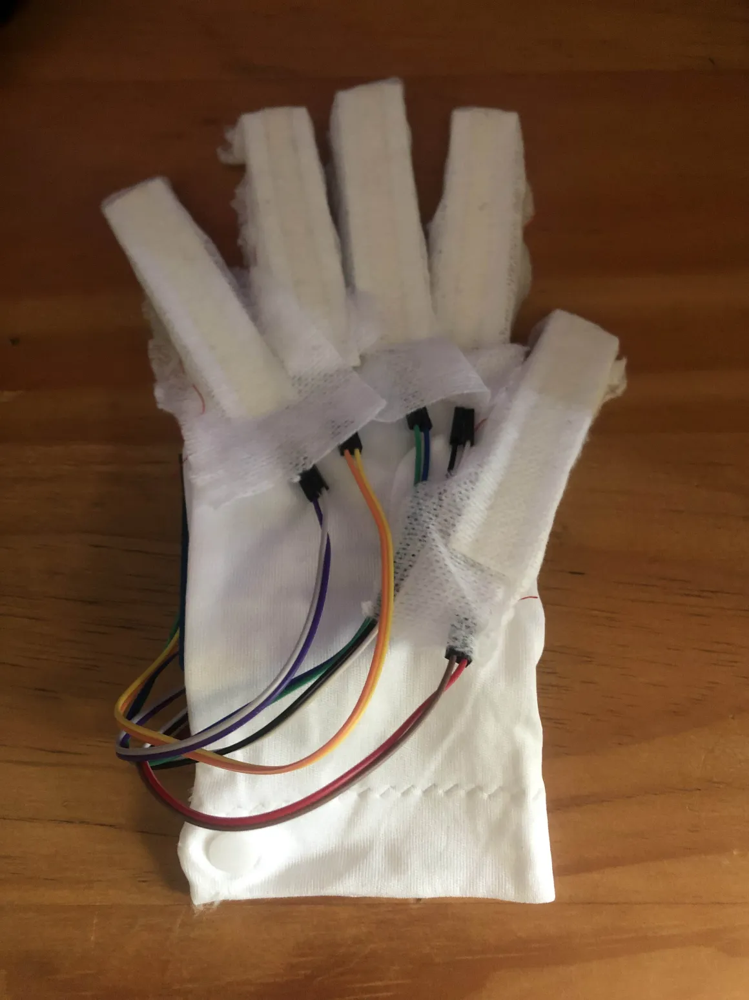
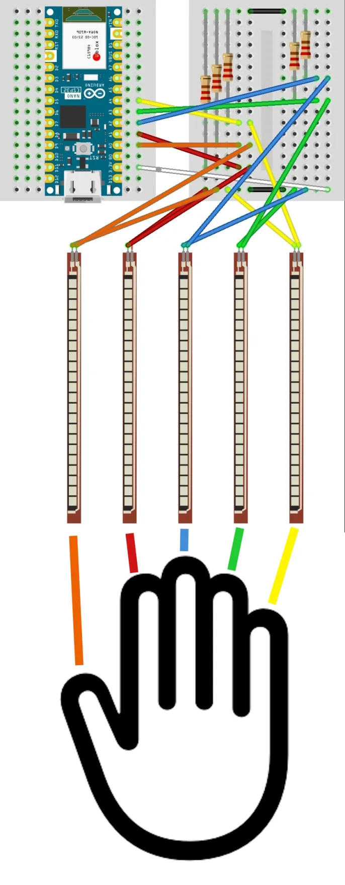
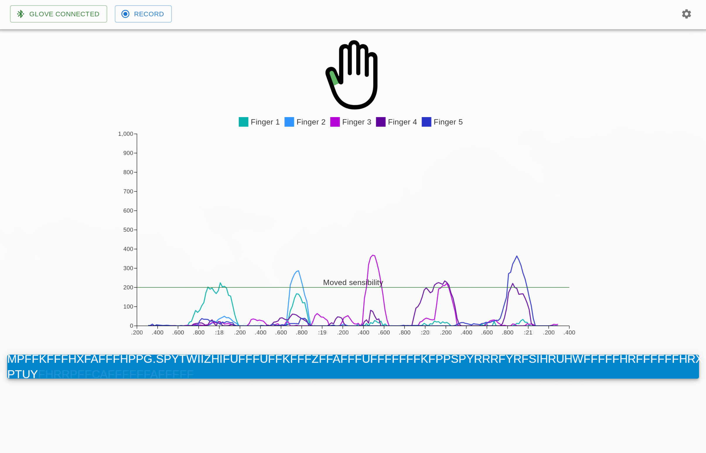

# COFIELD

Welcome to the COFIELD project !

COFIELD - for COmmunication with FIngers from Lucid Dreaming (we forgot what the 'E' means...) - is a project aimed at developing a new method of communication from lucid dreaming - as you may have guessed, with finger movements - and make it as accessible as possible, with low-cost DIY hardware and open-source software.

This is still a work-in-progress, but you can already build and implement the device yourself.

## Why this new method of communication ?

The dream phase of sleep is characterized by the inhibition (or atonia) of all the muscles of the body. All of them ? No, the eye and face muscles keep some of their tonicity during the dream phase.

So for a few decades the eye and face movements remained the gold-standard to communicate from the dreaming world. It fostered hundreds of exciting studies, including [this one](https://www.cell.com/current-biology/fulltext/S0960-9822(21)00059-2) which inspired the project.

But this method has - according to us - 3 major downsides:
- First,  moving the eyes in the dream - to the extreme up, down, left and right to have better contrast in the recording - is very destabilizing, it can alter significantly the content of the dream and make us wake-up precociously.
- Second, this is slow. You have 6 possibilities : up, down, left, right, smile and frown. You need about one second for each one and you can't do them at the same time. So the bitrate is limited to say the least.
- And third, this method necessitates an EEG (ElectroEncephaloGram) set-up not very accessible for hobbyists (the least pricey we know of being around 200$ and can mesure eye movements alone).

So how a method based on finger movements could improve on those points ?
- Moving fingers will not shake the dreamworld, so it would be more confortable and with less risks of early wake-ups.
- With fingers we have 10 possibilities (we may even have 20 if we could distinguish between flexion and extension), that can be sent very quickly and simultaneously.
- To captures the movements of the finger we only need pressure sensors linked to an arduino board, which is much less costly and complicated to build than electrodes linked to an amplifier.

*Wait, aren't the finger movements inhibited like the rest of the body in the dream phase ?* Good remark, the current scientific consensus excludes the possibility of body movements other than eye and face movements. But we didn't find any study that tried to prove it for finger movements.

The only study we know of that tried to detect voluntary finger movements during lucid dreaming is [this one](https://doi.org/10.1016/0301-0511(84)90056-5). And it was positive ! It showed the middle finger moving from an accelerometer.

Also we conducted pilots to test our device and we definitely observed and captured voluntary movement of all the fingers independently ! (we may publish recordings with proofs in the future but for now you can try it yourself if you want to be convinced)

---

## How to Do It Yourself !

### The sensor glove




Materials:
- Arduino Nano ESP32 board
- 5 flex sensors (we used [those ones](https://www.amazon.fr/dp/B08B88W3H5), others would most likely work but beware of the size to cover the finger)
- 5 resistors of 220 ohms
- 2 little breadboards (here 17x10)
- cables
- rigid PVC
- fabric
- velcro
- External battery (we used [this one](https://www.amazon.fr/dp/B0BHZ6RY6C))
- USB to USB-c cable
- Wrist band

The device is a glove with an Arduino Nano ESP32 board connected to five flexion sensors.

We HIGHLY encourage you to solder all the components and not use a test breadboard.

The board is put on the glove with velcro.

As for the flex sensors we tried different methods to implement them but the one that gave the best results in terms of contrasts and signal/noise ratio is to paste them to a rigid surface (here we used PVC and double-side tape) before attaching them below the fingers (here by sewing some fabric to tighten it).

We used an external battery to aliment it, that can be attached to the arm with a wrist band.



---

### Installation on the ESP32

#### Install the ESP32 board support in Arduino IDE

1. Install and open [**Arduino IDE**](https://www.arduino.cc/en/software/)
2. Go to **File → Preferences**
3. In **Additional Boards Manager URLs**, add:

```sh
https://espressif.github.io/arduino-esp32/package_esp32_index.json
```

4. Open **Tools → Board → Boards Manager**
5. Search for **ESP32**
6. Install **esp32 by Espressif Systems**

#### Upload the firmware to your ESP32

1. Connect your ESP32 via USB
2. Go to **Tools → Board** and choose: ESP32 Dev Module
select the correct USB port under **Tools → Port**.
3. Copy the code under `/arduino/output_glove.ino` from this repository into a new `.ino` file in Arduino IDE  
4. Click **Upload**

After the upload completes, you can now install the app trough the [releases](https://github.com/TheoOiry/cofield/releases/latest) and you're now ready to dream!


